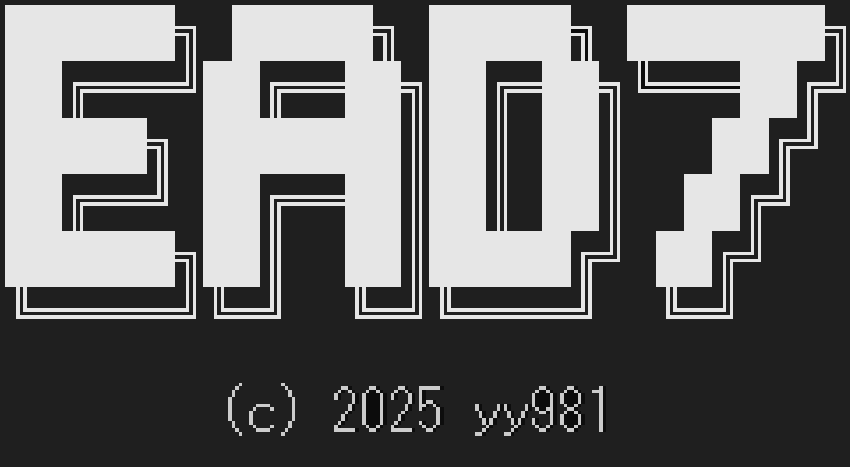

{: align="center"}


# EAD7 — Encryption And Decryption ver.7

AES-256-GCM をベースとした階層型鍵管理暗号化ツール。  
テキスト・ファイルの暗号化/復号を GUI と CUI の両方から操作できます。

---

## 概要

EAD7 は **3層の鍵階層** によって暗号鍵を安全に管理します。

```
マスターキー (MK)
  └─ 鍵暗号化鍵 (KEK)  ← MK + KID から導出
       └─ データ暗号化鍵 (DEK)  ← KEK + nonce から生成 (内部処理)
```

管理者が MK・KID・KEK を管理し、ユーザーは配布された KEK リスト (`kek.e7`) を使って暗号化/復号を行います。

---

## 機能

- **テキスト暗号化 / 復号** — ラベル指定で KEK を選択し、文字列を暗号化
- **ファイル暗号化 / 復号** — チャンク分割 + HMAC によるストリーミング暗号化
- **GUI モード** — Qt6 製のウィンドウ UI（引数なし起動で自動起動）
- **CUI モード** — コマンドライン引数による操作
- **管理者機能** — MK・KID・KEK の作成・管理、配布ファイル生成

---

## 暗号仕様

### テキストフォーマット (`.e7` テキスト)

```
[magic(0xE7):1B][ver:1B][mkid:1B][kid:16B][nonce:12B][暗号文(ct)][tag:16B]
```

### ファイルフォーマット (`.e7` ファイル)

```
fixedHeader : [magic(8B)][ver(1B)]
header      : [mkid(1B)][kid(16B)][chunkSize(4B)][chunkNumber(8B)][lastChunkSize(4B)]
body        : chunk([nonce:12B][tag:16B][ct]) × N
footer      : [hmac:32B]
```

- チャンクサイズ: デフォルト 1 MiB / 最小 4 KiB / 最大 16 MiB
- マジックバイト: `E7 46 5F 79 79 39 38 31`（= `"E7F_yy981"`）

### 使用アルゴリズム

| 用途 | アルゴリズム |
|------|-------------|
| MK 保護 | XChaCha20 (libsodium) |
| KEK/データ暗号化 | AES-256-GCM (Crypto++) |
| 鍵導出 | HKDF |
| パスワードハッシュ | Argon2id (`crypto_pwhash`) |
| HMAC | HMAC-SHA256 |

---

## ファイル種別

| ファイル名 | 入力 | 説明 |
|-----------|------|------|
| `MK.e7` | upass | マスターキーリスト（1ファイルのみ） |
| `{mkid}.kid.e7` | 平文+HMAC | KID（鍵ID）リスト。MKごとに存在 |
| `kek.e7` | token | ユーザー用 KEK リスト。tokenで暗号化 |
| `.raw.kek.e7` | 平文 | 一時ファイル。長期保管非推奨 |
| `.adm.kek.e7` | MK | 管理者用 KEK リスト |
| `.dst.kek.e7` | upass | 配布用一時パスワードで暗号化された KEK リスト |

### ディレクトリ構造（実行時）

```
SD (LocalAppData/ead7/)
├── kek.e7          ← ユーザー用 KEK リスト
└── master/ (SDM)
    ├── MK.e7
    ├── 1.kid.e7
    ├── 2.kid.e7
    └── keks/ (SDMK)
        ├── 一般.adm.kek.e7
        └── private.adm.kek.e7
```

---

## ビルド

### 依存ライブラリ

| ライブラリ | 用途 |
|-----------|------|
| Qt6 (Core, Gui, Widgets) | GUI |
| Crypto++ | AES-256-GCM |
| libsodium | XChaCha20, Argon2id, AESNI 検出 |
| Boost.Locale | 文字列処理 |
| nlohmann/json | JSON 読み書き |

### ビルド手順

```bash
cmake -B build -DCMAKE_BUILD_TYPE=Release
cmake --build build
```

> C++23 以上が必要です。

---

## 使い方 (CUI)

```bash
# GUI モードで起動
EAD7.exe

# テキストを暗号化
EAD7.exe enc <label> <plaintext>

# テキストを復号
EAD7.exe dec <base64_cipher>

# ファイル情報の表示
EAD7.exe info <filepath>

# DST ファイルから kek.e7 へ変換（ユーザー初回セットアップ）
EAD7.exe <path/to/*.dst.kek.e7>

# 管理者メニュー
EAD7.exe master

# バージョン表示
EAD7.exe ver

# ヘルプ
EAD7.exe help
```

---

## KEK の配布フロー

```
管理者                              ユーザー
  │                                    │
  ├─ adm.kek.e7 を作成                 │
  ├─ dst.kek.e7 を生成（配布用PW設定） │
  ├─ dst.kek.e7 を配布 ──────────────→│
  │                                    ├─ EAD7.exe <dst.kek.e7> を実行
  │                                    ├─ 配布用PW を入力
  │                                    └─ kek.e7 として保存（token で再暗号化）
```

---

## バージョン

バージョン情報は `ver.csv` で管理されます。  
現在: **gen 7**

---
Generated by Claude Sonnet 4.6